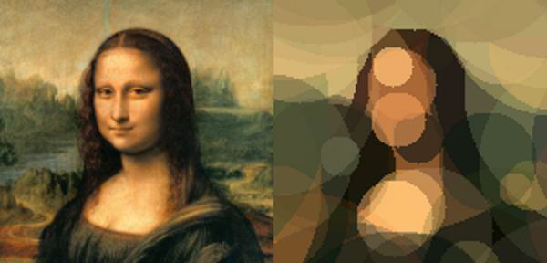

Doodle
====================

Doodle is a project that approximates a source image using semitransparent circles of different sizes and colors.
The project implements two optimizers: one using a genetic algorithm, and another based on simulated annealing.

The project was implemented as a learning exercise with correctness as the primary goal. As a result, the performance is far from optimal.

## License

See the [LICENSE](./LICENSE.md) file for license rights and limitations (MIT).
